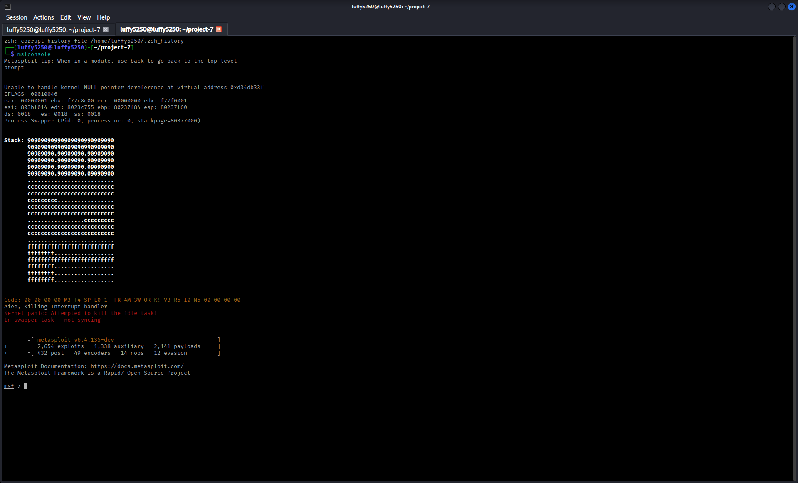
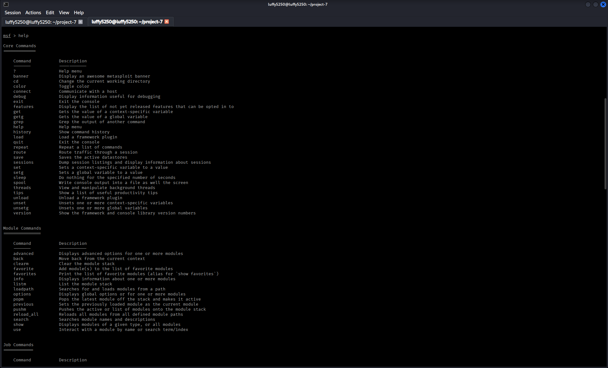
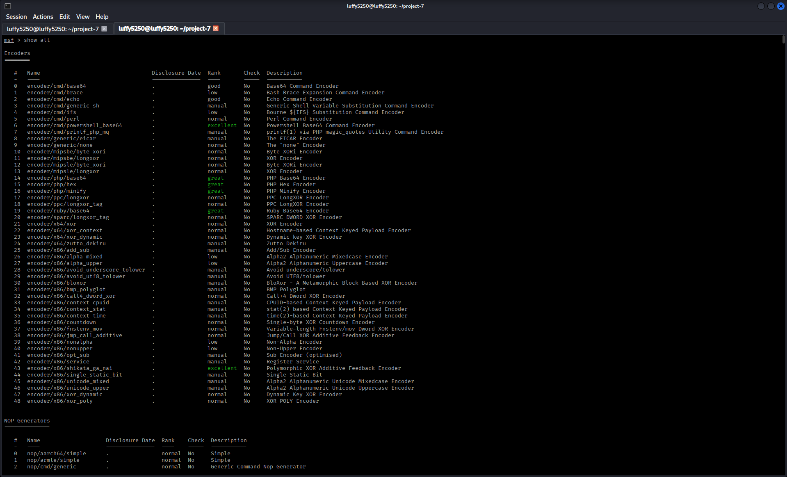
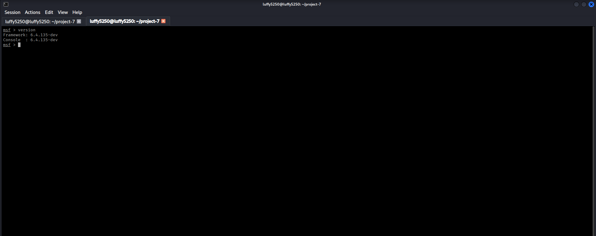
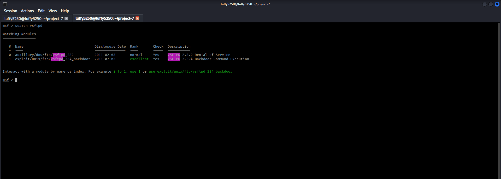
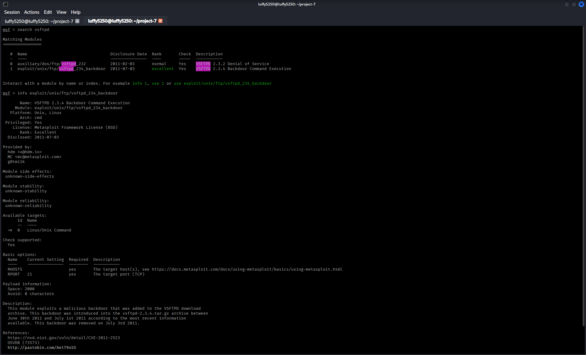
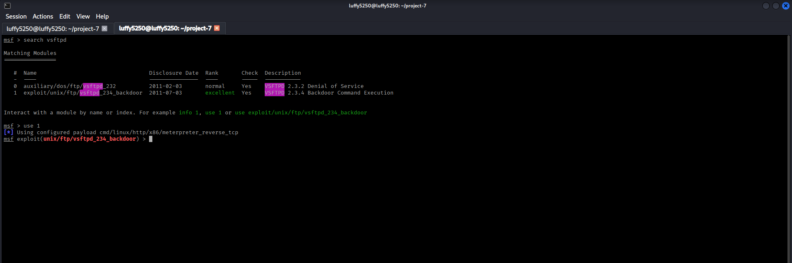
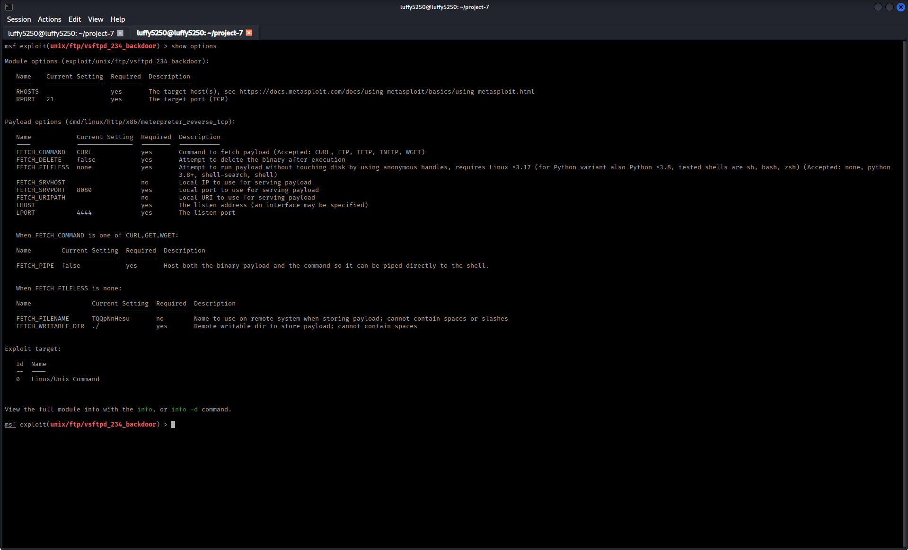
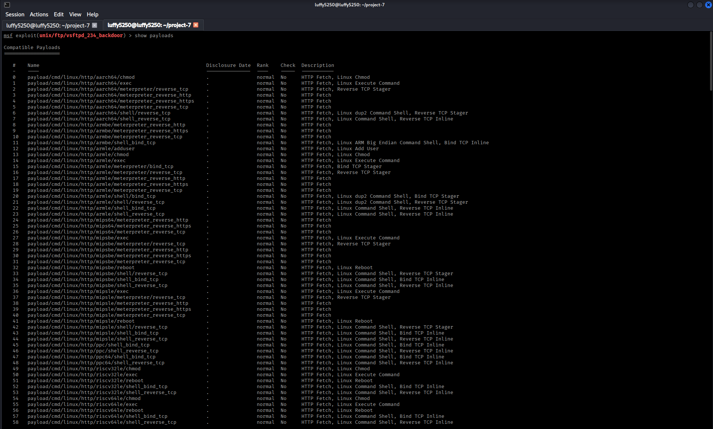

# system-hacking-project

# Part 1 – Introduction to the Metasploit Framework

## Objective

The goal here is to get to know the Metasploit Framework. We need to understand what it is used for how it works and how to use it. This will help us do authorized testing in an environment.

# What is the Metasploit Framework?

The Metasploit Framework is a tool that helps security experts test for weaknesses, in systems. They use it to make sure systems are secure.

This tool has parts that help with testing. It can find weaknesses take advantage of them and even help fix problems.

In this project we will only use Metasploit in a controlled lab. The lab has Kali Linux, Windows 7 and Metasploitable 2.

# Core Components of Metasploit

The Metasploit Framework has types of parts. These include:

- Exploits

- Payloads

- Auxiliary Modules

- Post-Exploitation Modules

- Encoders

- NOP Generators

Each part does a job when testing security.

## 1. Launch the Metasploit Console

### Scenario

We need to start the Metasploit Framework.

### Command

```bash

msfconsole

```

### Description

This command starts the Metasploit Framework console. It also loads all the parts.

### Screenshot



## 2. Display Available Help Commands

### Scenario

We want to see the help menu.

### Command

```bash

help

```

### Description

This command shows us all the Metasploit commands and how to use them.

### Screenshot



## 3. View Available Module Categories

### Scenario

We need to list all the module categories in Metasploit.

### Command

```bash

show all

```

### Description

This command shows us all the module categories and the modules we have.

### Screenshot



## 4. Display Framework Version

### Scenario

We want to know what version of Metasploit we have.

### Command

```bash

version

```

### Description

This command tells us what version of the Metasploit Framework we are using.

### Screenshot



# Key Concepts Learned

- Metasploit Framework

- Module Categories

- Exploits

- Payloads

- Auxiliary Modules

- Post Modules

# conclusion

In this part I learned:

- What the Metasploit Framework is used for.

- What module categories are available.

- How to use the Metasploit console.

- How to check what version of Metasploit I have.


--------------------------------------------------------------------------------------------------------------------------------------------------------------------------------------------------------------------------

# Part 2 – Exploit Selection and Payload Configuration

## Objective

I want to learn how to find the exploit modules get detailed information about an exploit choose the best exploit and set up a payload for a target in a lab.

---

# Why Select the Correct Exploit?

Before I try to exploit a target I need to do a things. I have to find the exploit.
I have to understand what the exploit needs. I have to choose a payload that works with the exploit..
I have to set up the target information.
If I choose the exploit or payload my assessment will probably fail.

---

## 1. Search for an Exploit

### Scenario

I need to search the Metasploit module database for an exploit that works with the target service.

### Command

```bash

search vsftpd

```

### Description

This command searches the Metasploit database for exploit modules that are related to the VSFTPD service. The VSFTPD service is what I am looking for.

### Screenshot



---

## 2. Display Exploit Information

### Scenario

I want to review information about the exploit I selected. The exploit is what I need to learn more about.

### Command

```bash

info exploit/unix/ftp/vsftpd_234_backdoor

```

### Description

This command shows me information, about the exploit, including what it does where I can find information what targets it works with what payloads I can use and what options I need to set. The exploit is what I am trying to learn about.

### Screenshot



---

## 3. Select the Exploit Module

### Scenario

I need to load the exploit module into my workspace. The exploit module is what I want to use.

### Command

```bash

use exploit/unix/ftp/vsftpd_234_backdoor

```

### Description

This command loads the VSFTPD backdoor exploit module, which's the exploit I want to use. Now I can set it up.

### Screenshot



---

## 4. Display Required Options

### Scenario

I need to review the configuration I need to set up before I run the exploit. The exploit is what I am trying to set up.

### Command

```bash

show options

```

### Description

This command shows me what options I need to set up for the exploit module I selected. The exploit module is what I am working with.

### Screenshot



---

## 5. Display Compatible Payloads

### Scenario

I want to see what payloads work with the exploit I selected. The exploit is what I am trying to find payloads for.

### Command

```bash

show payloads

```

### Description

This command lists all the payloads that work with the exploit module I loaded. The exploit module is what I am using.

### Screenshot



---

# Key Concepts Learned

- I learned about exploit discovery. Exploit discovery is what I did.

- I learned about exploit modules. Exploit modules are what I used.

- I learned about compatibility. Payload compatibility is important.

- I learned about module configuration. Module configuration is what I did.

- I learned about options. Required options are what I needed to set up.

---

# conclusion

In this part I learned how to find exploit modules. 
I learned how to review exploit documentation. 
I learned how to load an exploit module. 
I learned how to identify configuration options. 
I learned how to view payloads before I try to exploit a target. 
The exploit is what I was working with.
